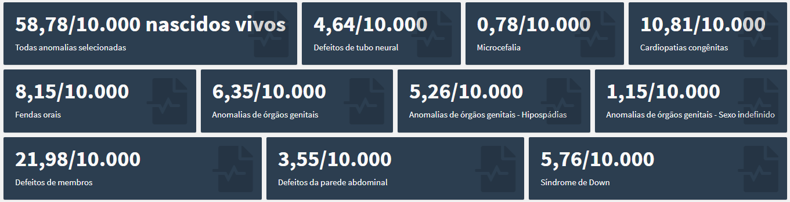

<style>

body {
  padding-top:5px
}

.navbar{
  visibility: hidden
}

</style>


# Resumo das prevalências (2011-2020)

```{r, echo=FALSE, message=FALSE, warning=FALSE, fig.width= 8, fig.height= 4, layout="l-screen-inset"}


```